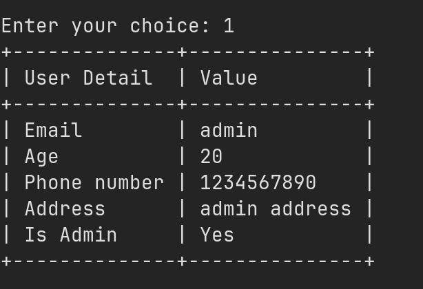
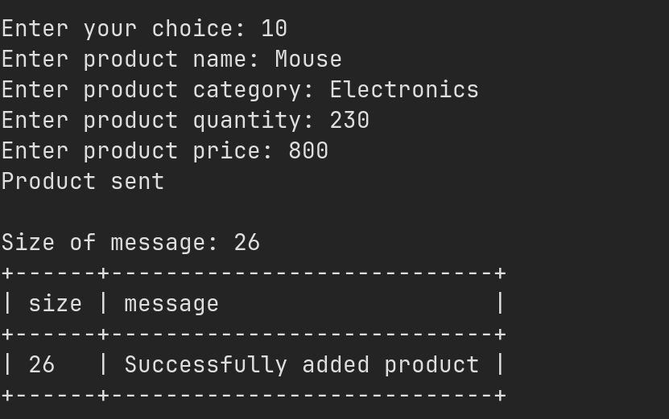

# OS MiniProject - Online Shopping System

This is a client-server based application that allows users to browse and purchase products online. The system has features such as user authentication, product browsing, adding products to cart, checkout, and order placement. The server-side of the application is responsible for handling client requests, managing product and user data, and processing orders. The client-side of the application provides a user-friendly interface for ( users / admins ) to interact with the system using terminal ( GUI ). The project uses various programming concepts such as socket programming, file handling, and multi-threading, semaphores to implement the functionality of the system.

## Installation

Clone the repo and run the below commands.

```bash
  chmod 777 install.sh
  ./install.sh
```

This will generate `init`,`server` and `client` executables in the root directory.

- First run the `init` to initialize the necessary files and creates required semaphore array.

```bash
    ./init
```

- Creates files : `usersFile` `ordersFile` `productsFile` `cartsFile`
- Creates a default admin user (email=admin) and a default non-admin user (email=rohit-1) with password = password for both, for easy testing.
- `init`: Adds a few products too.
- Open up two separate terminals in the `pwd`. Run the `server` in one terminal first and then the `client` in the other.

```bash
    ./server
    ./client
```

- If you face errors like `Error in binding` go to `data/data.h` and change `PORT_NO`.
- Interact with the server using `client` CLI, where `client` talks to `server` using sockets.

## User Menu


| choice | functionality | screenshot |
| ------ | ------------------- | ---------- |
| 0 | Logout |  |
| 1 | See user details |  |
| 2 | See all products |  |
| 3 | Add product to cart |  |
| 4 | See cart items |  |
| 5 | Update cart item |  |
| 6 | Place order |  |

## Admin Menu

| choice | functionality     | screenshot                                          |
| ------ | ----------------- | --------------------------------------------------- |
| 0      | Logout            |         |
| 1      | See admin details |   |
| 10     | Add a product     |  |
| 11     | See all products  |  |
| 12     | Update a product  |  |
| 13     | Delete a product  |  |

## File structure and design choices

| File                       | Role                                                                                                                                                                                                                                                                                              |
| -------------------------- | ------------------------------------------------------------------------------------------------------------------------------------------------------------------------------------------------------------------------------------------------------------------------------------------------- |
| `data/data.h`              | defines the data structures and constants used by the program, making it easier to work with and manipulate the data stored in the programs's data files.                                                                                                                                         |
| `init.c`                   | responsible for setting up the initial state of the data files used by the system, ensuring that they exist and contain the necessary data for the system to function properly.                                                                                                                   |
| `init.c`                   | creates semaphore array containing `PRODUCTS_TOTAL_ALLOWED` semaphores in that set. So we assume that `productsFile` will have at max `PRODUCTS_TOTAL_ALLOWED`. So we create that many binary semaphores to record lock that i_th product, while admin is updating or deleting that i_th product. |
| `server.c`                 | responsible for setting up the server-side of the system, accepting incoming client connections, and creating new threads to handle each client connection. It also calls the appropriate server handler upon successful login to handle client requests and send responses back to the client.   |
| `client.c`                 | responsible for setting up the client-side of the system, connecting to the server, and prompting the user to enter commands to interact with the system. It also sends requests to the server and displays responses from the server to the user.                                                |
| `handler/server_handler.c` | responsible for redirecting the request to appropriate controller functions that handle client requests on the server-side of the system, performing the necessary operations on the data files, and sending responses back to the client.                                                        |
| `handler/client_handler.c` | responsible for implementing the controller functions that handle server responses on the client side                                                                                                                                                                                             |
| `locker/locker.c`          | responsible for implementing a simple locking mechanism using binary semaphore array to prevent multiple clients from accessing the same data file at the same time, ensuring data consistency and integrity.                                                                                     |
| `messager/messager.c`      | responsible for implementing the message passing functionality between the client and server, ensuring that messages are sent and received correctly and error-free.                                                                                                                              |
| `tableFormatters/fort.c`   | responsible for implementing the table formatting library used by the program, making it easy to display data in a formatted and organized manner in the console output.                                                                                                                          |
| `logger/logger.c`          | responsible for implementing the logging functionality used by the program, making it easy to create log files and debug errors                                                                                                                                                                   |

##

## OS Concepts Used

- **Socket**: Sockets are used to establish a connection between the client and server terminals. The client sends requests to the server using sockets, and the server responds to these requests using the same socket. This allows for real-time communication between the client and server, enabling the user to browse and purchase products seamlessly.

- **Multithreading**: Multithreading is used to handle multiple client connections simultaneously. Each client connection is handled by a separate thread, allowing the server to handle multiple requests at the same time. This improves the performance of the system and ensures that the user experience is not affected by the number of clients connected to the server.

- **File Locking**: File locking is used to prevent multiple clients from accessing the same file simultaneously. When a client accesses a file, the specific record of the file is locked, preventing other clients from accessing it until the first client has finished. This ensures that the data in the file is not corrupted due to multiple clients accessing it at the same time.

- **Semaphores**: Semaphores are used to limit the number of clients that can access a particular resource simultaneously. For example, the system may limit the number of clients that can purchase a particular product at the same time. Semaphores ensure that the resource is not overloaded, preventing the system from crashing due to excessive load.

## Authors

- [@RohitShah1706](https://github.com/RohitShah1706)

## License

[MIT](https://choosealicense.com/licenses/mit/)
